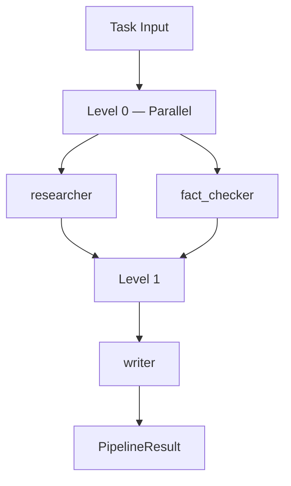

# agentflow

[](https://pypi.org/project/agentflowkit/)
[](https://github.com/KaramQ6/agentflow/actions/workflows/ci.yml)
[](https://codecov.io/gh/KaramQ6/agentflow)
[](https://pypi.org/project/agentflowkit/)
[](https://www.python.org/downloads/)
[](https://opensource.org/licenses/MIT)

Lightweight multi-agent AI pipeline framework. Define agents with decorators, give them **tools**, wire them into a DAG, and run independent stages **in parallel** — with built-in cost tracking, caching, timeouts, streaming, and observability.

- **Tool / function calling** — `@tool` turns any Python function into an LLM tool; agents run a bounded ReAct loop
- **Parallel execution** — agents with no inter-dependencies run concurrently via `asyncio.gather()`
- **Cost tracking** — per-agent and per-pipeline USD cost from built-in pricing tables
- **Token streaming** — `LLM.astream()` yields tokens for interactive UIs
- **Decorator-based** — define agents as plain async functions, no boilerplate
- **LLM response caching** — in-memory (or Redis) cache cuts cost on repeated runs
- **Per-agent timeouts & retries** — `timeout=` and pipeline-level retry with exponential backoff + jitter
- **Conditional branching** — skip agents dynamically based on upstream outputs
- **Observability** — lifecycle `Hooks` + structured JSON logs with run IDs
- **Provider agnostic** — any OpenAI-compatible API (OpenAI, Groq, Together, Ollama, vLLM, OpenRouter)
- **Fully typed** — ships `py.typed`; passes `mypy --strict`
- **Minimal deps** — only `openai` + `pydantic`

📖 **[Full documentation →](https://KaramQ6.github.io/agentflow/)**

## Install

```bash
pip install agentflowkit

# Optional: Redis cache backend
pip install "agentflowkit[redis]"
```

## Architecture

Independent agents at the same DAG level execute **concurrently**. Dependent agents wait for their prerequisite level to complete before starting.



## Quick Start

```python
import asyncio
from agentflow import Agent, Pipeline, LLM

llm = LLM(
    model="llama-3.3-70b-versatile",
    base_url="https://api.groq.com/openai/v1",
    api_key="your-groq-key",  # Free at console.groq.com
)

@Agent(name="researcher", role="Research Analyst")
async def researcher(task: str, context: dict) -> str:
    return f"Research this topic thoroughly: {task}"

@Agent(name="fact_checker", role="Fact Checker")
async def fact_checker(task: str, context: dict) -> str:
    return f"Find key facts and statistics about: {task}"

@Agent(name="writer", role="Content Writer")
async def writer(task: str, context: dict) -> str:
    research = context["researcher"]
    facts = context["fact_checker"]
    return f"Write an article using:\nResearch: {research}\nFacts: {facts}"

# researcher and fact_checker run in parallel (Level 0)
# writer runs after both complete (Level 1)
pipe = Pipeline(llm=llm)
pipe.add(researcher)
pipe.add(fact_checker)
pipe.add(writer, depends_on=["researcher", "fact_checker"])

async def main():
    result = await pipe.run("AI in Healthcare")
    print(result.output)
    print(f"Run ID: {result.run_id} | Tokens: {result.total_tokens} | Cost: ${result.total_cost:.6f}")

asyncio.run(main())
```

## Features

### Tool / Function Calling

Give an agent tools and it becomes a **ReAct agent**: the model decides which
functions to call, agentflow runs them, feeds results back, and repeats until a
final answer. Schemas are generated from your type hints — you never write JSON.

```python
from agentflow import Agent, Pipeline, LLM, tool

@tool
def get_stock_price(ticker: str) -> dict:
    """Look up the latest price for a stock ticker."""
    return {"ticker": ticker, "price": 229.87}

@tool
def calculator(expression: str) -> float:
    """Evaluate an arithmetic expression like '10 * 229.87'."""
    return eval(expression, {"__builtins__": {}}, {})

@Agent(name="analyst", role="Financial Analyst", tools=[get_stock_price, calculator])
async def analyst(task: str, context: dict) -> str:
    return task

pipe = Pipeline(llm=llm)
pipe.add(analyst)
result = await pipe.run("What do 10 shares of AAPL cost?")

# Inspect the tool calls the model made:
for call in result.get("analyst").metadata["tool_calls"]:
    print(call["tool"], call["arguments"], "->", call["result"])
```

Sync and async tools both work (sync tools run in a thread). The loop is bounded
by `max_tool_iterations` (default 6), and tool errors are fed back to the model
to recover rather than crashing the run.

### Parallel Execution

Agents with no declared dependencies on each other run concurrently at the same DAG level:

```python
pipe.add(agent_a)               # Level 0
pipe.add(agent_b)               # Level 0 — runs in parallel with agent_a
pipe.add(agent_c, depends_on=["agent_a", "agent_b"])  # Level 1
```

**Benchmark:** 3 parallel agents (0.5s each) → total time ~0.5s vs 1.5s sequential.

### LLM Response Caching

Cache identical LLM calls to save tokens and speed up repeated runs:

```python
from agentflow import LLM, InMemoryCache

cache = InMemoryCache(default_ttl=3600)  # 1-hour TTL
llm = LLM(model="gpt-4o-mini", api_key="...", cache=cache)
```

Redis backend (requires `pip install "agentflowkit[redis]"`):

```python
from agentflow import LLM, RedisCache

llm = LLM(model="gpt-4o", cache=RedisCache(url="redis://localhost:6379/0"))
```

Cache hits appear in results: `result.agents_with_cache_hits`, `agent_result.cached`.

### Cost Tracking

Every result carries an estimated USD cost from built-in per-model pricing:

```python
result = await pipe.run("Summarize the news")
print(f"Agent cost:    ${result.get('summarizer').cost:.6f}")
print(f"Pipeline cost: ${result.total_cost:.6f}")

# Register prices for custom / self-hosted models (unknown models cost $0):
from agentflow import register_price
register_price("my-finetuned-model", prompt_per_1m=0.50, completion_per_1m=1.50)
```

Prices use longest-prefix matching, so `gpt-4o-2024-08-06` resolves to `gpt-4o`.
Cache hits bill `$0.00`.

### Token Streaming

Stream a completion token-by-token for interactive UIs:

```python
messages = [{"role": "user", "content": "Explain async pipelines in one line."}]
async for token in llm.astream(messages):
    print(token, end="", flush=True)
```

### Observability

`Pipeline.run()` is silent by default. Pass `Hooks` to observe the full lifecycle
and bridge to logging, metrics, OpenTelemetry, or Langfuse:

```python
from agentflow import Pipeline, LoggingHooks

pipe = Pipeline(llm=llm, hooks=LoggingHooks("research-pipeline"))
result = await pipe.run("AI in Healthcare")
# → {"event": "agent_complete", "agent": "writer", "tokens": 812, "cached": false, ...}
```

Subclass `Hooks` and override `on_agent_start` / `on_agent_end` / … to emit spans
to your own backend. A hook that raises is caught and warned, never crashing the run.

### Per-Agent Timeouts

Protect against slow or hung LLM calls:

```python
pipe.add(slow_agent, timeout=10.0)   # raises AgentTimeoutError after 10s
```

### Conditional Branching

Dynamically route execution based on upstream agent outputs:

```python
pipe.add(classifier)

pipe.add(
    urgent_handler,
    depends_on=["classifier"],
    condition=lambda ctx: "urgent" in ctx["classifier"].lower(),
)
pipe.add(
    standard_handler,
    depends_on=["classifier"],
    condition=lambda ctx: "urgent" not in ctx["classifier"].lower(),
)
```

Skipped agents emit `agent_skipped` events in streaming mode.

### Pipeline Retry

Automatically retry transient agent failures with exponential backoff:

```python
pipe = Pipeline(llm=llm, retry_failed_agents=2)  # up to 2 retries: 1s, 2s
```

### Structured Output Validation

Enforce Pydantic schemas on LLM responses:

```python
from pydantic import BaseModel

class Report(BaseModel):
    title: str
    summary: str
    confidence: float

@Agent(name="analyst", role="Data Analyst", output_schema=Report)
async def analyst(task: str, context: dict) -> str:
    return f"Analyze and respond as JSON matching: {Report.model_json_schema()}\nTask: {task}"

# result.get("analyst").metadata["validated_output"] → Report dict
```

### Rate Limiting

Throttle API calls for rate-limited providers:

```python
from agentflow import LLM, RateLimiter

limiter = RateLimiter(requests_per_minute=60, max_concurrent=5)
llm = LLM(model="gpt-4o-mini", api_key="...", rate_limiter=limiter)
```

### Event Streaming

Real-time pipeline monitoring:

```python
async for event in pipe.stream("AI in Healthcare"):
    match event.type:
        case "agent_start":
            print(f"▶ {event.agent} (level {event.data['level']})")
        case "agent_complete":
            print(f"✓ {event.agent} — {event.data['tokens']} tokens, cached={event.data['cached']}")
        case "agent_skipped":
            print(f"⏭ {event.agent} skipped")
        case "pipeline_complete":
            print(f"Done — {event.data['total_tokens']} tokens across {event.data['levels_executed']} levels")
```

### Structured Logging

Production-ready JSON logging with run IDs:

```python
from agentflow import PipelineLogger

log = PipelineLogger("research-pipeline", run_id=result.run_id)
log.log_pipeline_complete(result.run_id, result.total_tokens, result.total_duration)
# → {"timestamp": "...", "level": "INFO", "event": "pipeline_complete", "run_id": "a1b2c3d4", ...}
```

## Why agentflow?

| Feature | agentflowkit | LangChain | CrewAI |
|---------|:---:|:---:|:---:|
| Parallel DAG execution | ✅ | Partial | ❌ |
| Tool / function calling | ✅ | ✅ | ✅ |
| Built-in cost tracking | ✅ | Partial | ❌ |
| Token streaming | ✅ | ✅ | Partial |
| Install size | ~2 deps | 100+ deps | 30+ deps |
| Async-first | ✅ | Partial | ❌ |
| Decorator API | ✅ | ❌ | ❌ |
| Built-in response cache | ✅ | Via callbacks | ❌ |
| Observability hooks | ✅ | ✅ | Partial |
| Fully typed (`py.typed`, strict) | ✅ | Partial | Partial |
| Lines of core code | ~1.4k | ~200k | ~15k |
| Per-agent timeout | ✅ | ❌ | ❌ |
| Conditional branching | ✅ | ✅ | Partial |

agentflow is designed for engineers who want a **small, auditable, async-first** foundation for multi-agent systems — not a kitchen sink framework.

## Class-Based Agents

For agents with custom logic beyond prompt construction:

```python
from agentflow import BaseAgent, AgentResult

class DatabaseAgent(BaseAgent):
    def __init__(self, db_connection):
        super().__init__(name="db_agent", role="Database Analyst")
        self.db = db_connection

    async def execute(self, task: str, context: dict, llm) -> AgentResult:
        # Fetch real data, then ask LLM to analyze it
        data = await self.db.query(task)
        response = await llm.generate([
            {"role": "system", "content": f"You are a {self.role}."},
            {"role": "user", "content": f"Analyze this data: {data}\nTask: {task}"},
        ])
        return AgentResult(
            agent=self.name,
            output=response["content"],
            tokens_used=response["tokens"],
            duration=response["duration"],
        )
```

## Supported Providers

```python
# OpenAI
llm = LLM(model="gpt-4o-mini", api_key="sk-...")

# Groq (free tier available)
llm = LLM(model="llama-3.3-70b-versatile",
           base_url="https://api.groq.com/openai/v1",
           api_key="gsk_...")

# Ollama (local, no API key)
llm = LLM(model="llama3.2", base_url="http://localhost:11434/v1", api_key="ollama")

# Together AI
llm = LLM(model="meta-llama/Llama-3-70b-chat-hf",
           base_url="https://api.together.xyz/v1",
           api_key="...")
```

## Examples

- [`examples/tool_agent.py`](examples/tool_agent.py) — a ReAct agent that calls tools (calculator + stock lookup)
- [`examples/streaming_and_cost.py`](examples/streaming_and_cost.py) — token streaming + USD cost tracking
- [`examples/research_crew.py`](examples/research_crew.py) — 3-agent sequential research pipeline
- [`examples/code_reviewer.py`](examples/code_reviewer.py) — 2-agent code review pipeline
- [`examples/market_analysis_crew.py`](examples/market_analysis_crew.py) — 5-agent parallel market analysis (diamond DAG)
- [`benchmarks/parallel_speedup.py`](benchmarks/parallel_speedup.py) — measured parallel vs. sequential speedup (~2×)

## Contributing

See [CONTRIBUTING.md](CONTRIBUTING.md) for development setup, coding style, and PR requirements.

## Changelog

See [CHANGELOG.md](CHANGELOG.md).

## License

MIT
